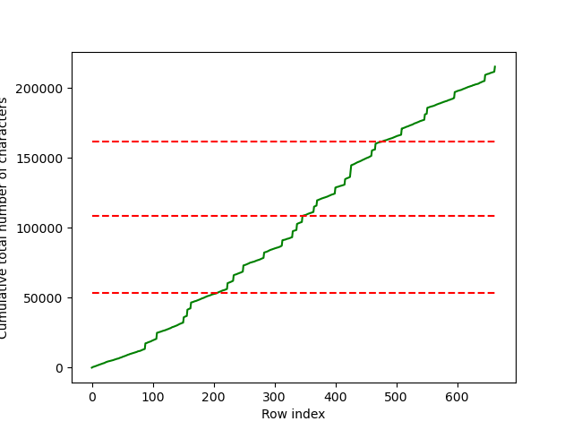

# Divide CSV files into even chunks

## Introduction

This code splits a CSV file into (approximately) evenly sized chunks. If a file contains rows that have a large variance in their length, just dividing the file into, say, 4 chunks can lead to wildly different file sizes. This code divides a CSV file into chunks that are about the same size on disk.

## Test data generation

To generate synthetic data for testing `split_csv.py`, run the script `generate_data.py`. The data generator will create a simple CSV file where one of the fields (free text) has a significant variance in length. Technically, the number of sentences generated is drawn from a mixture of uniform distributions.

## Split CSV file

To split the CSV:

1. Set the required parameters in `split_csv.py`;

2. Run the script.

Two figures will be produced by the code. The first shows the number of characters in a row of CSV data as a function of the row index.

The figure shows how the number of characters is either small (around 200) or large (around 4000).

The second figure produced shows where the input file will be divided. The green line shows the cumulative total of the number of characters. The dashed red lines shows where the input CSV file will be divided. The even spacing is a visual indication that the algorithm has worked correctly.

